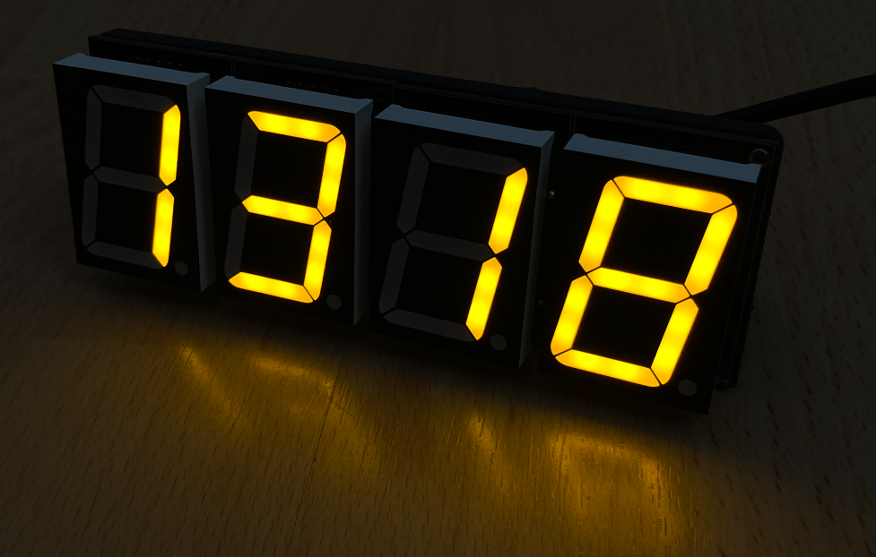

# 7 segment driver
 
This project is simple driver for two displays of this type: 
<a href="https://www.tme.eu/cz/details/opd-s15013ly-bw/7-segment-led-displays/opto-plus-led/">TME link</a> 
Houses two displays per module (daisy-chainable). One shift 74HC595 per register and has PWM. 
The main reason, why this exists is that there was a sale on the modules so I got them super cheap and the amber color looked really nice, so I've decided to build a <b>CLOCK</b>. Features: <il>
Easily expandable</li>
<li>PWM dimming
<li>ready for wemos backpack
<li>cool color
</il>
